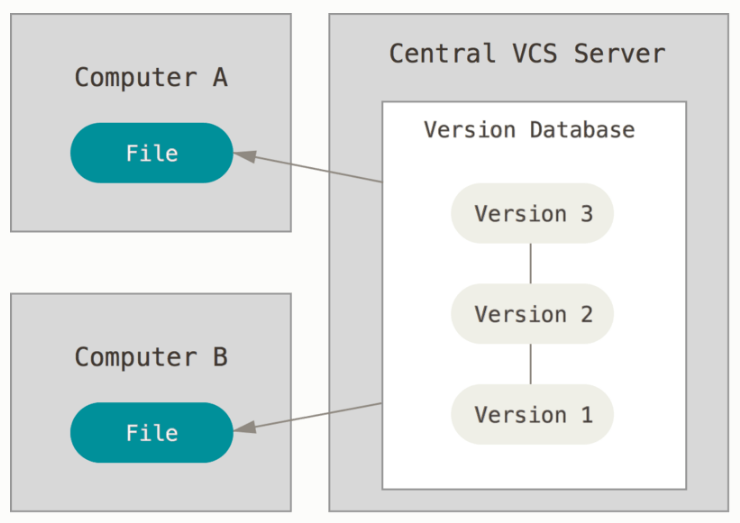
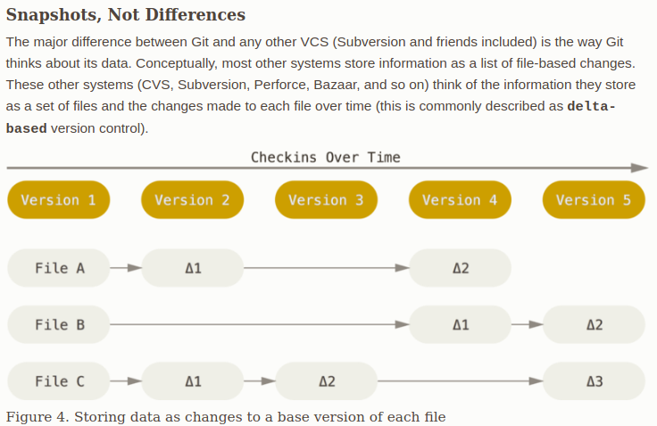
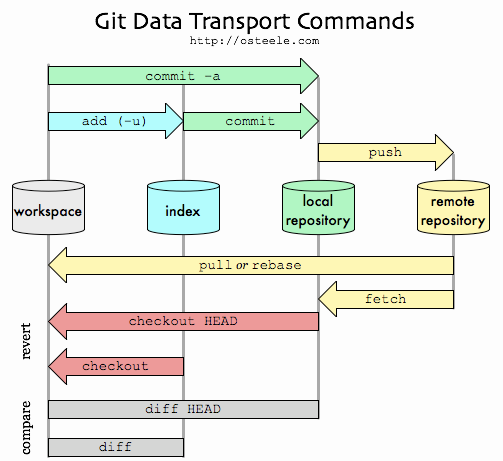
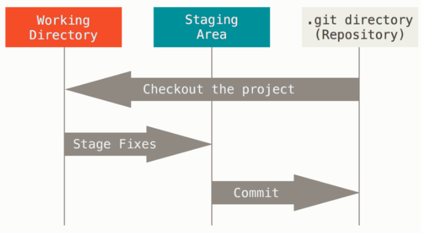
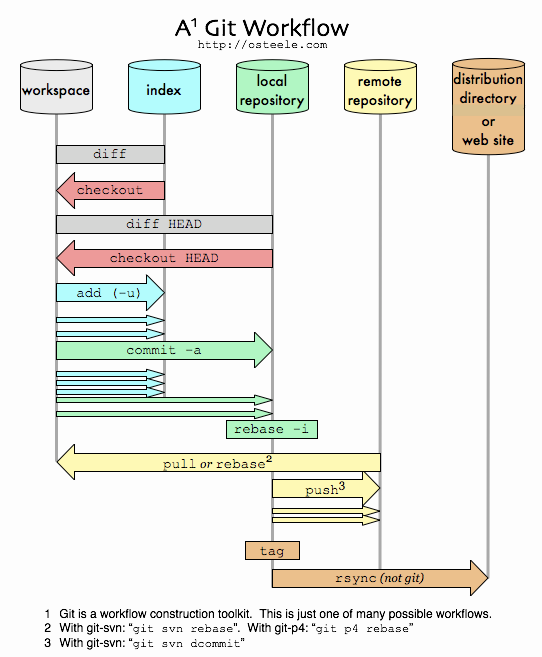

- [1. GDB GCC Learning for Zhituo](#1-gdb-gcc-learning-for-zhituo)
  - [1.1. GDB Top CommandList](#11-gdb-top-commandlist)
  - [1.2. GCC Top CommandList](#12-gcc-top-commandlist)
- [2. MakeFile for GCC compiler](#2-makefile-for-gcc-compiler)
- [3. RR for GDB](#3-rr-for-gdb)
- [4. Git and GItlab for Development](#4-git-and-gitlab-for-development)
# 1. GDB GCC Learning for Zhituo
> GBD GCC gives me the opportunity to `see` inside the code.
## 1.1. GDB Top CommandList
> The ultimate goal of a piece of code is to translate the data into a different form. Reading the data in the register and memory is the 'key'. 

1. b main   clear main
2. run | start | cont   r  s  c
3. n
4. si
5. s
6. print  p 
7. li
8. explore
9. watch
10. 'x'  check help x. [To see the memory original data.](https//ftp.gnu.org/old-gnu/Manuals/gdb/html_node/gdb_55.html)
11. info registers [info registers](https://ftp.gnu.org/old-gnu/Manuals/gdb/html_node/gdb_60.html#SEC61). See the register
12. layout asm     [layout next](https://www.youtube.com/watch?v=bWH-nL7v5F4&ab_channel=ChrisBourke)
13. bt:  backtrace  dump the stack.
14. Ctrl+d: break the loop
15. refresh: ctrl+l
16. info locals
17. layout split   layout regs
18. TUI:  info win     fs next


> [Example 1](https://www.youtube.com/watch?v=bWH-nL7v5F4&ab_channel=ChrisBourke) Find and Add the primary number together.
  - backtrace| refresh|watch|print|*array@10 command

## 1.2. GCC Top CommandList
> optimizer sucks. Undefined state sucks. compiler sucks.  Check each step in: preprocessing, assembly, linker make file, opt-code. 
1. -O0  -O1 -O2   optimiztin
2. -Wall
3. -g   
4. -ansi  -std=c99  set up the compiler version
5. -fsanitize=undefined  program instrumentation option.  
   > Control adding run-time instrumentation to the code it normally generates. In this, one can find out undefined state.
6. --help=optimizers  see help manual of a specific option.


# 2. MakeFile for GCC compiler


# 3. RR for GDB
> RR is used to for debug time travel back for record and replay for the gdb. Find and repeat a bug is difficult.


# 4. Git and GItlab for Development
> Git manage the version of software for group developing. 
> To Sync or recover data from group data. 


> To keep track of the `snapshot` (instead of save a lot of version, cares about the data).


> Git Data Transport Commands.  When you make a commit, Git stores a commit object that contains a pointer to the snapshot of the content you staged. This object also contains the author’s name and email address, the message that you typed, and pointers to the commit or commits that directly came before this commit (its parent or parents): zero parents for the initial commit, one parent for a normal commit, and multiple parents for a commit that results from a merge of two or more branches.
- [ ] git add (index level/stage area)  Git uses for this checksumming is called a SHA-1 hash. Everything in Git is checksummed before it is stored and is then referred to by that checksum. This means it’s impossible to change the contents of any file or directory without Git knowing about it.  
- [ ]  git commit, Git checksums each subdirectory (in this case, just the root project directory) and stores them as a tree object in the Git repository. Git then creates a commit object that has the metadata and a pointer to the root project tree so it can re-create that snapshot when needed.  

- [ ] `head` and `master` pointers are default ones. Head automatically point to the new committed file. `master` point to the new committed file when no branching name is given. If branching name is given use git branch, `master` do not move. The branch pointer wil automately point to the new committed file.
- [ ] `origin/master` and `origin/main` are the pointers to the repository on the server.




1. ~/.gitconfig
  > This is used for saving the settings. Email, username, default test editor.

2. Fundamental Commmands
  ```shellscript
  ;call help 
  man git-<verb>
  git status


  git init
  git clone
  git add
  git commit    ; commit the change
 
  git log --all ; without --all master pointer will not shown.
  git branch
  git diff
  git switch
  git push origin main/master


;View staged and unstaged changed
git diff --cached   ==   git diff --staged

;Remove a file from git : remove it from your staging area and then commit. Not to remove the file from current directory.
git rm a.md

;Rename a file to another then add to current stage area
git mv readme.md readme


;review back the previous code what is happeed
git log 
git log --pretty=format:"%h - %an, %ar : %s"

;unstage a file
git reset HEAD file.md
git restore --staged CONTRIBUTING.md  ; restore the unstage
git restore CONTRIBUTING.md   ; unmodify a modified file 


; Remote repositories on the server
git remote -v
git remote add <shortname> <url> ; Add remote repositories to git.
git remote add origin git@github.com:/Elesider/C_Language_Learning.git
git push -u origin master

git fetch origin
git fetch show origin
git push origin --delete main  ; delete the main branch (should set other branch as default in github, default branch cannt be removed)


;Tagging  to a repository's history
git log
git tag -a v1.2 9fceb02(part of the checksum number) 

  ```

3. [A good introduction to github personal experience](https://blog.osteele.com/2008/05/my-git-workflow/)
 


4. Using the ssh with RSA private key to setup github account. For security reason. 

5.Fundamental Introduction Examples

```Shell
; create a new repository on the command line
git init
git add README.md
git commit -m "first commit"
git branch -M master
git remote
git remote add origin git@github.com:Elesider/Linux_CourseNotes.git
git push -u origin master


; push an existing repository from the command line
git remote add origin git@github.com:Elesider/Linux_CourseNotes.git
git remote
git branch -M master
git push -u origin master
```


